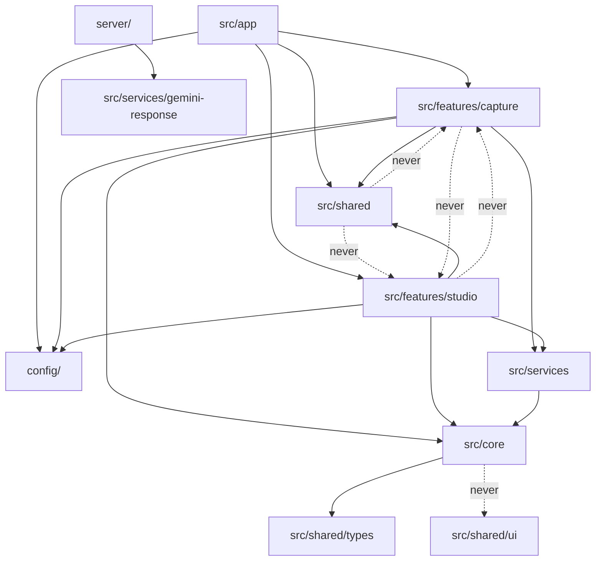
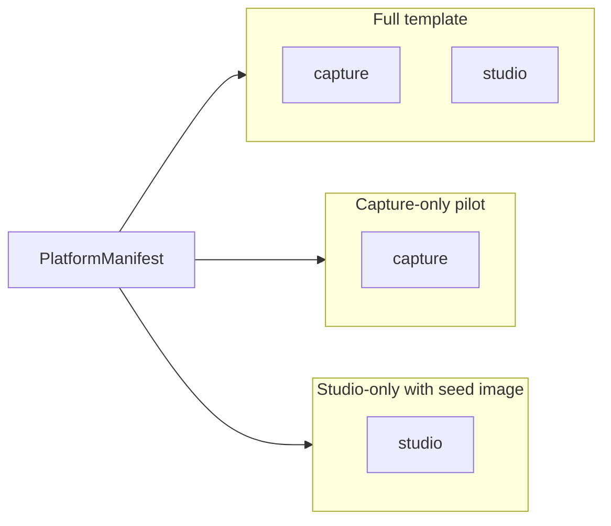

# virtualFit — Template Blueprint

> Target architecture for replicable product deployments ("churreras").
> Each client deployment differs only in manifest + brand assets.

## Target folder tree

```
virtualFit/
├── index.html                          # Vite entry HTML (root required)
├── package.json
├── server/                             # Node API server
│   ├── index.ts                        # Entry (express + vite middleware)
│   └── routes/
│       └── generate.ts                 # /api/generate, /api/generate-video
├── tooling/                            # Build pipeline (not product logic)
│   ├── vite.config.ts
│   ├── tsconfig.app.json
│   ├── tailwind.config.js
│   ├── postcss.config.js
│   └── eslint.config.js
├── config/                             # Product config (manifest, wardrobe)
│   ├── types.ts
│   ├── index.ts                        # getManifest() — resolves via VITE_CLIENT_ID
│   ├── wardrobePaths.ts
│   └── clients/
│       ├── _template/                  # Skeleton for new clients
│       └── nomad/                      # Reference deployment
├── src/
│   ├── main.tsx                        # React entry
│   ├── vite-env.d.ts
│   ├── app/
│   │   ├── App.tsx                     # Shell: phase routing, manifest wiring
│   │   └── globals.css                 # Token imports + Tailwind directives
│   ├── features/
│   │   ├── capture/                    # Camera → model generation
│   │   │   ├── StartScreen.tsx
│   │   │   ├── CameraCapture.tsx
│   │   │   └── useCameraStream.ts
│   │   └── studio/                     # Try-on studio (canvas + wardrobe rail)
│   │       ├── Canvas.tsx
│   │       ├── WardrobePanel.tsx
│   │       ├── LookStack.tsx
│   │       └── useTryOnSession.ts
│   ├── core/                           # Domain logic (no UI)
│   │   ├── look/
│   │   │   ├── lookComposition.ts
│   │   │   └── lookComposition.test.ts
│   │   └── media/
│   │       ├── framing.ts
│   │       └── garmentFile.ts
│   ├── services/                       # External API adapters
│   │   ├── geminiService.ts            # Client-side barrel
│   │   ├── gemini-image.service.ts
│   │   ├── gemini-video.service.ts
│   │   └── ...
│   ├── shared/                         # Cross-feature UI + utilities
│   │   ├── ui/                         # Design system primitives
│   │   ├── components/                 # icons, Spinner, Footer
│   │   ├── hooks/                      # useUiSfx
│   │   ├── context/                    # SfxProvider
│   │   ├── lib/                        # utils, display, theme, motionPresets
│   │   └── types/                      # WardrobeItem, OutfitLayer
│   └── styles/                         # Global CSS (tokens, themes, kiosk)
│       ├── tokens/
│       ├── themes/
│       ├── kiosk-display.css
│       └── studio-mupi.css
├── integrations/                       # Future optional adapters
│   └── README.md
├── public/
│   ├── brand/{clientId}/logo.png
│   └── garments/{clientId}/
└── docs/
```

## Dependency boundaries



**Rules:**
- Features import shared + core + services, never each other.
- `core/` contains pure domain logic — no React, no UI imports.
- `shared/ui/` is the design system layer — zero feature-specific logic.
- `config/` is read-only data; any module may import it.
- `server/` runs in Node — may import `src/services/gemini-response.ts` only (shared response parser).

## Client manifest contract

```typescript
// config/types.ts (see AGENTS.md)
interface PlatformManifest {
  clientId: string;
  theme: PlatformTheme;
  features: { videoLoop; wardrobeFeed; kioskIdle };
  brand: { productName; logoSrc; logoAlt; poweredBy? };
  display: { defaultMode: 'mupi' | 'desktop' };
  wardrobe: WardrobeItem[];   // from config/clients/<id>/wardrobe.ts
  copy: PlatformCopy;         // from config/clients/<id>/copy.ts
}
```

### Resolution

```
config/index.ts → getManifest()
  1. Read VITE_CLIENT_ID (default: 'nomad')
  2. Import config/clients/{clientId}/manifest.ts
  3. Apply VITE_* env overrides (display, wardrobeFeed)
```

### New client checklist

1. `npm run new-client -- <clientId>`
2. Add `public/brand/<clientId>/logo.png` and garments under `public/garments/<clientId>/`
3. Edit `config/clients/<clientId>/wardrobe.ts` and `copy.ts`
4. `npm run verify-clients`
5. `VITE_CLIENT_ID=<clientId> npm run build` — see [CLIENT_SMOKE.md](./CLIENT_SMOKE.md)

## Feature composition

Deploy variants by manifest + routing (no fork):



Today `App.tsx` runs capture → studio. To ship capture-only, gate studio mount with a manifest flag in a future PR; keep domain split in `src/features/` so tree-shaking stays possible.

## Integration extension points

The `integrations/` directory holds optional adapters registered via manifest feature flags. Each integration:

1. Exports an `init(manifest)` function
2. Is conditionally imported in `src/app/App.tsx` based on `isFeatureEnabled()`
3. Receives the resolved manifest — never reads env directly

Planned slots: `analytics/`, `crm/`, `payments/`, `creative-loader/`. QR rewards are a separate project.

## Gaps vs current state

| Area | Status | Notes |
|------|--------|-------|
| Client pack (G1–G2) | **Done** | Per-client wardrobe, copy, assets; `nomad` reference |
| Factory (G3) | **Done** | `new-client`, `verify-clients`, CI matrix |
| Production gate (G4–G5) | **Done** | API auth, rate limit, Playwright smoke |
| Platform (G6) | **Done** | `AGENTS.md`, skeleton doc, integrations contract |
| Feature tree-shake | Partial | capture-only / studio-only flags not wired in `App.tsx` |
| Creative loader / QR | Out of core | `integrations/` stubs only |
| Event bus | Backlog | Analytics adapters when needed |

See [TEMPLATE_MATURITY.md](./TEMPLATE_MATURITY.md) for gate definitions.
